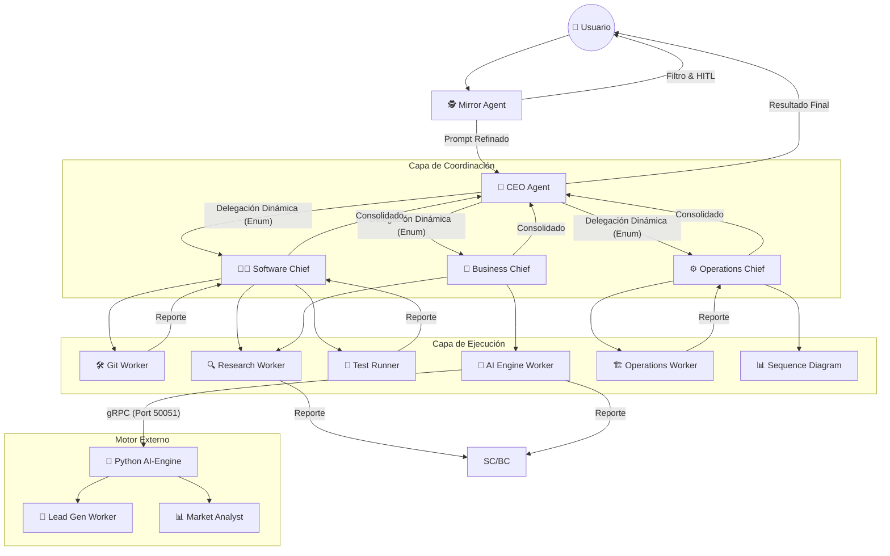

# Organigrama de la Startup Autónoma

Este documento define la estructura de mando y ejecución del ecosistema de agentes. La jerarquía es estricta para garantizar la alineación estratégica y la calidad técnica.

## 🗺️ Mapa Jerárquico Actualizado (2026)

## 🎭 Roles y Responsabilidades Clave

### 1. CEO Agent (The Dynamic Orchestrator)
- **Hito:** Ahora usa `CEOResponseSchema` con enums estrictos para evitar alucinaciones en la delegación.
- **Acción:** Mapea misiones a `software_chief` o `business_chief`.

### 2. Business Chief (The Growth Driver)
- **Hito:** Implementado para manejar el pipeline comercial.
- **Acción:** Genera payloads gRPC para el AI Engine pidiendo leads o análisis.

### 3. Operations Chief (The Infrastructure Guardian)
- **Hito:** Implementado para gestionar despliegues, salud del sistema y observabilidad.
- **Acción:** Ejecuta diagnósticos de infraestructura y genera diagramas de secuencia automáticos.

### 4. AI Engine Worker (The Python Bridge)
- **Hito:** Nodo genérico en el backend (Node.js) que se comunica con el AI-Engine (Python).
- **Acción:** Ejecuta tareas de larga duración como scraping sin bloquear el grafo principal.

---

## 🧠 Persistencia Semántica (Engram)
Todos los agentes guardan sus hitos en Engram. 
- `architecture/*`: Decisiones de diseño.
- `achievement/*`: Tareas completadas con éxito.
