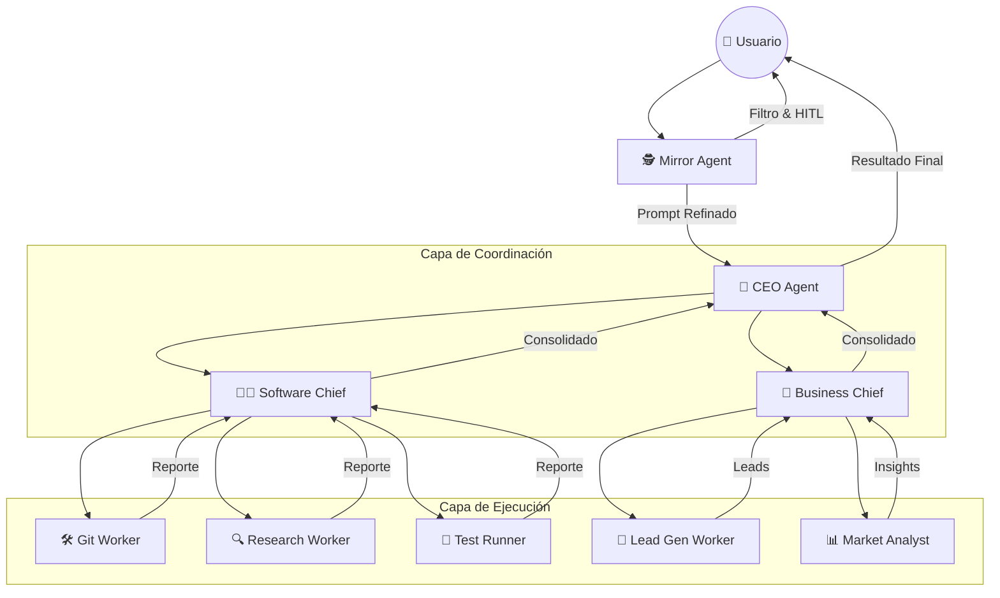

# Organigrama de la Startup Autónoma

Este documento define la estructura de mando y ejecución del ecosistema de agentes. La jerarquía es estricta para garantizar la alineación estratégica y la calidad técnica.

## 🗺️ Mapa Jerárquico

## 🎭 Roles y Responsabilidades

### 0. Mirror Agent (The Style Guard)
- **Misión:** Aduana de entrada. Clarifica la intención del usuario.
- **Acción Clave:** Pide aprobación humana antes de arrancar el gasto de tokens.

### 1. CEO Agent (The Strategic Orchestrator)
- **Misión:** Traducir visión en mandatos. Gestiona el plan maestro.
- **Acción Clave:** Decide a qué Chief activar según el objetivo de negocio.

### 2. Chiefs (The Domain Supervisors)
- **Software Chief:** Responsable de la arquitectura, calidad y código. Maneja el ciclo TDD.
- **Business Chief:** Responsable del crecimiento, leads y validación de mercado.

### 3. Workers (The Specialists)
- **Git Worker:** Ejecuta operaciones de repositorio (branches, commits).
- **Research Worker:** Investiga el código y documentación existente.
- **Test Runner:** Ejecuta validaciones automáticas para asegurar que nada se rompa.
- **Lead Gen Worker:** Busca oportunidades de negocio en la web (LinkedIn, etc.).

---

## 🧠 Persistencia Semántica (Engram)
Todos los niveles jerárquicos consultan y guardan conocimiento en **Engram**, asegurando que la startup tenga una "sabiduría acumulada" y no repita errores del pasado.
