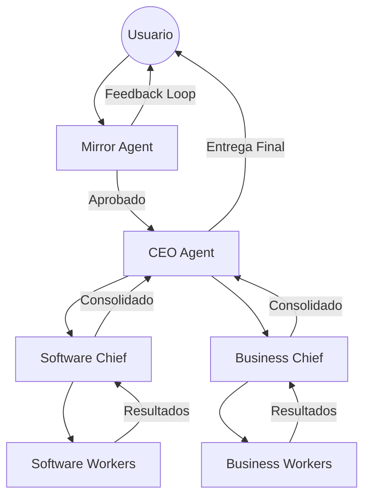

# System Architecture Overview

El ecosistema de agentes opera bajo un modelo de **Orquestación Basada en Grafos** utilizando LangGraph.js. A diferencia de las cadenas lineales, este sistema permite ciclos de retroalimentación, toma de decisiones dinámica y estados persistentes.

## El Orquestador (LangGraph.js)

El sistema se define como un `StateGraph` dinámico. Utilizamos la **primitiva `Command`** (estándar 2026) para permitir que los nodos decidan su propio flujo de control en tiempo real.

### Componentes de Vanguardia
- **Nodos Inteligentes (Smart Nodes):** Cada agente (CEO, Chief, Worker) devuelve un `Command` que especifica el siguiente destino o estado de interrupción.
- **Aristas Fluidas:** El CEO puede saltar directamente a un Worker o volver al Mirror sin redefinir el grafo.
- **Estado (State):** Un canal de comunicación tipado (Zod) validado en cada frontera de nodo.

## Jerarquía de Operación

1.  **Entrada:** Usuario ingresa un prompt en la CLI.
2.  **Mirror Loop:** Optimiza el prompt con validación humana.
3.  **Strategic Planning:** El `CEO Agent` genera un plan maestro (Persistido en Engram).
4.  **Delegación:** El CEO activa al `Chief` (Software o Business).
5.  **Ejecución:** El Chief desglosa subtareas para los `Workers` (o delega al AI Engine).
6.  **Validación:** Resultados validados por Chief y finalmente por el CEO.

## Diagrama Conceptual

## Estructura de Implementación

- **`/backend` (Node.js)**: Cerebro lógico (LangGraph.js), servicios, herramientas, observabilidad.
- **`/ai-engine` (Python)**: Motor de razonamiento pesado (FastAPI, Agentes, Tools ML).
- **`/frontend` (Next.js 15)**: Consola de control.

## Persistencia y Memoria
- **Operativa:** Gestionada por LangGraph Checkpoints (pausa/reanudación).
- **Semántica:** Gestionada por Engram (Persistencia de largo plazo: decisiones, estilos, aprendizajes).
- **Observabilidad:** `trace_id` único compartido entre Backend y AI Engine para trazabilidad completa.
