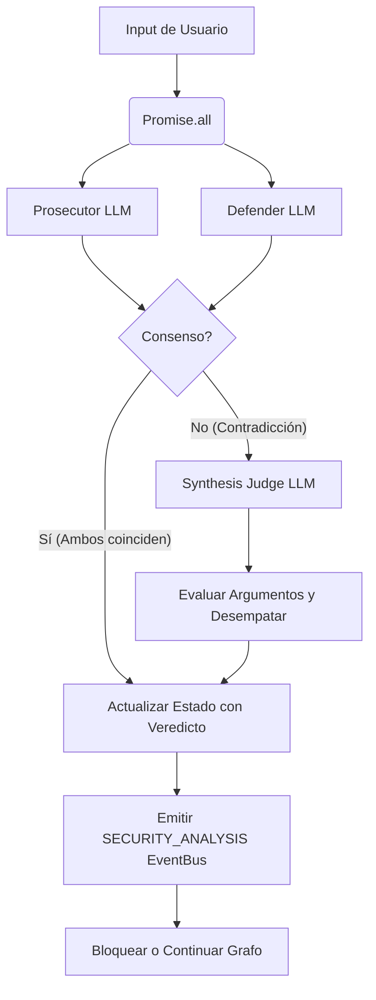

# Diseño Técnico: Protocolo Judgment Day en Aduana Sentinel

## Diagrama de Ejecución

## Arquitectura de Prompts
Se requieren tres perfiles de sistema (System Prompts) distintos:
- **`PROSECUTOR_PROMPT`**: Configurado para sesgo negativo (detectar vulnerabilidades asumiendo intención maliciosa).
- **`DEFENDER_PROMPT`**: Configurado para sesgo positivo (defender intención legítima del usuario).
- **`JUDGE_PROMPT`**: Perfil neutral. Recibe el historial, más las salidas de `PROSECUTOR_PROMPT` y `DEFENDER_PROMPT`.

## Costo y Telemetría
Al ejecutarse en paralelo o con el juez, los costos se sumarán. El esquema de datos de `AduanaSentinelSchema` actual (Zod) permanece inalterable para no romper la compatibilidad con el front ni la telemetría, ya que el resultado final seguirá siendo un objeto con `is_injection`, `threat_level` y `reasoning`.

- `latency_final`: `Math.max(lat_prosecutor, lat_defender) + (contradiction ? lat_judge : 0)`
- `cost_final`: `cost_prosecutor + cost_defender + (contradiction ? cost_judge : 0)`
- `tokens_final`: suma de los tokens de las llamadas invocadas.
