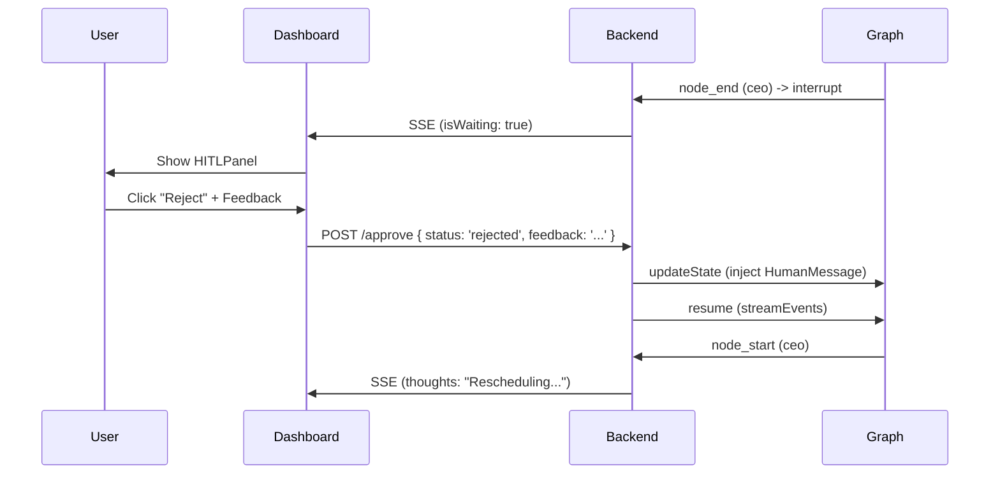

# Technical Design: Human-in-the-Loop Gateways (#104)

## Architecture Overview
The HITL system relies on LangGraph's native `interrupt_after` capability combined with a custom `SimpleRedisSaver` checkpointer. The integration layer bridge the gap between the graph's internal state and the SSE-based UI.

## Component Design

### 1. State Management (LangGraph)
- **Interrupt Nodes**: `ceo`, `operations_chief`.
- **State Flags**: 
    - `is_mission_approved`: Boolean. Controls whether the graph proceeds to worker nodes or returns to the CEO.
    - `next_node`: String. Directs the flow after strategic decisions.

### 2. Backend integration (Express)
- **AgentController.approve**:
    - Route: `POST /api/agents/approve`
    - Payload: `{ threadId: string, status: 'approved' | 'rejected', feedback?: string }`
    - Logic:
        - Calls `GraphService.resumeAgent`.
        - Streams events back to the client.

### 3. Service Layer (GraphService)
- **resumeAgent**:
    - Uses `graph.updateState(config, updates)` to modify the thread's memory.
    - If `status === 'rejected'`, it uses `new HumanMessage(feedback)` to trigger the re-planning logic.
    - Uses a `do-while` loop with `continue` if `is_mission_approved` is true and we reach the CEO again, to skip unnecessary pauses.

### 4. Frontend (Next.js + React)
- **useAgentStream**: Manages the state of `isWaiting`.
- **HITLPanel**:
    - Animated with `framer-motion`.
    - Uses `AnimatePresence` for smooth entry/exit.
    - Connected to `agentService` for API calls.

## Sequence Diagram

