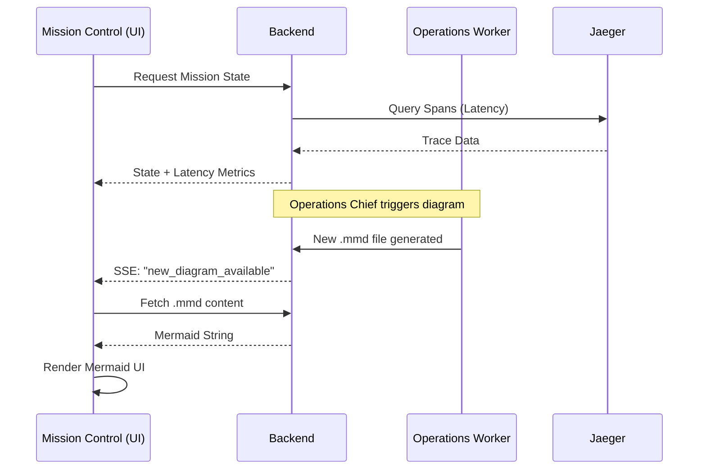

# Design: Fase C - Infraestructura y Visibilidad

## Architecture Decisions

### AD1: Integración de Mermaid en React
Usaremos `mermaid.js` directamente con un wrapper de React personalizado en lugar de librerías pesadas de terceros. El componente escuchará actualizaciones del estado del grafo que incluyan el contenido Mermaid.

### AD2: Telemetry API Endpoint
Añadiremos un nuevo endpoint en el backend `/api/infra/telemetry` que consulte Jaeger o los agregados internos de `TelemetryService` para devolver latencias recientes por nodo. El frontend consultará esto periódicamente o lo recibirá vía SSE.

### AD3: Docker Health Logic
Actualizaremos `check-docker.js` para usar `net` (Node.js builtin) para intentar conexiones sockets a los puertos mapeados, asegurando que el port-forwarding local de Docker esté funcionando.

## Data Flow (Sequence Diagram)

## Component Changes

### Backend
- `src/services/telemetryService.ts`: Añadir método `getRecentMetrics()`.
- `src/routes/infra.ts`: Crear nuevo router para telemetría.
- `scripts/check-docker.js`: Inyectar lógica de `net.connect`.

### Frontend
- `src/components/dashboard/LiveSequenceDiagram.tsx`: Nuevo componente.
- `src/components/dashboard/OrchestrationGraph.tsx`: Modificar `CustomAgentNode` para aceptar prop `latency`.
- `src/hooks/useMissionTelemetry.ts`: Hook para centralizar la lógica de polling/SSE de métricas infra.
